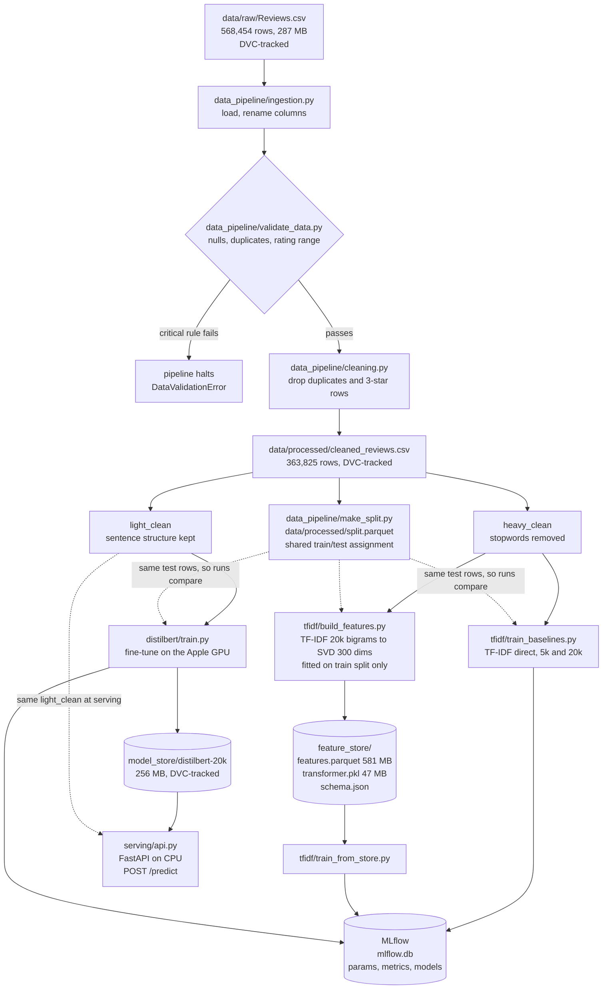

# Review Sentiment Classifier

Classifies customer product reviews as Positive or Negative. Built as an ML
engineering project, so the focus is the full pipeline, not just the model:
data validation, a feature store, experiment tracking, and dataset versioning.

Dataset is Amazon Fine Food Reviews, 568,454 rows. A review's star rating becomes
the label: 4 or 5 stars is Positive, 1 or 2 is Negative. 3-star reviews are dropped
as neutral.

| | |
|---|---|
| Best model | DistilBERT, fine-tuned |
| Macro F1 | 0.8917 |
| Accuracy | 0.9457 |
| Data pipeline runtime | about 23 seconds on all 568k rows |
| Fine-tune runtime | about 15 minutes on an Apple M3 GPU |

## Architecture



Two feature paths exist on purpose. `tfidf/train_baselines.py` uses TF-IDF directly and
scores higher. The feature store trades some accuracy for guaranteed consistency
between training and serving. See [design decisions](#design-decisions).

## Repo layout

The folders follow the seam between the two model families. `data_pipeline/` is
shared, `tfidf/` and `distilbert/` never import from each other, and
`comparison/` holds the scripts that deliberately need both.

```
pipeline.py                          run Week 1 end to end, writes artifacts
harness_m2.py                        same stages, prints input/output, writes nothing
data_pipeline/ingestion.py           load raw CSV, rename columns
data_pipeline/validate_data.py       quality checks, halts on critical failure
data_pipeline/cleaning.py            heavy_clean and light_clean
data_pipeline/make_split.py          shared train/test split, one file both paths read
tfidf/feature_engineering.py         TF-IDF builder
tfidf/build_features.py              builds the feature store
tfidf/train_baselines.py             baseline models from the cleaned CSV
tfidf/train_from_store.py            model trained from the feature store
distilbert/tokenization.py           DistilBERT tokenizer
distilbert/train.py                  DistilBERT fine-tune
comparison/train_controlled_50k.py   both models on one identical 50k sample
comparison/threshold_analysis.py     precision at matched recall, both models
feature_store/                       features.parquet, transformer.pkl, schema.json
model_store/                         DistilBERT weights, DVC-tracked
serving/  ui/                        prediction API and browser test page
reports/validation_report.md         data validation write-up
plan.md                              task tracking and open items
```

## Setup

Needs Python 3.13 and [uv](https://docs.astral.sh/uv/).

```bash
git clone <repo-url>
cd sentiment-classifier

uv venv venv
uv pip install --python venv -r requirements.txt
```

The datasets are versioned with DVC, not stored in git. Fetch them with:

```bash
uv run dvc pull
```

**No DVC remote is configured yet**, so `dvc pull` will not work from a fresh clone.
Until that is set up, put `Reviews.csv` into `data/raw/` by hand. The file is available
from [Kaggle](https://www.kaggle.com/datasets/snap/amazon-fine-food-reviews).

## How to run

**Step through each stage, writing nothing.** Best way to see what the pipeline does.
It prints the input and output of all five stages and pauses between them.

```bash
venv/bin/python harness_m2.py
```

**Run the real pipeline.** Writes `cleaned_reviews.csv` and
`validation_report.json` into `data/processed/`.

```bash
venv/bin/python pipeline.py --input data/raw/Reviews.csv --text-col Text --rating-col Score
```

**Create the shared train/test split.** One file both model paths read, so every
run is scored on the same test rows.

```bash
venv/bin/python data_pipeline/make_split.py
```

**Build the feature store.** Reads the cleaned CSV and the shared split,
writes `feature_store/`.

```bash
venv/bin/python tfidf/build_features.py
```

**Train the baseline models.** Two TF-IDF variants, logged to MLflow.

```bash
venv/bin/python tfidf/train_baselines.py
```

**Train from the feature store.** Logs a combined transformer-plus-classifier model,
so anything served carries its own feature logic.

```bash
venv/bin/python tfidf/train_from_store.py
```

**Fine-tune DistilBERT.** Uses the Apple GPU through MPS, about 15 minutes for one
epoch on a 20,000-row sample. Saves weights to `model_store/distilbert-20k`.

```bash
venv/bin/python distilbert/train.py
```

**View the experiments.**

```bash
venv/bin/mlflow ui --backend-store-uri sqlite:///mlflow.db
```

## Serving the model

`serving/api.py` serves the fine-tuned DistilBERT model. Start it with:

```bash
venv/bin/uvicorn serving.api:app --port 8000
```

Ask for a prediction:

```bash
curl -X POST localhost:8000/predict \
     -H 'Content-Type: application/json' \
     -d '{"text": "Arrived stale and tasted awful. Waste of money."}'
```

```json
{"label": "negative", "confidence": 0.9888,
 "cleaned_text": "Arrived stale and tasted awful. Waste of money."}
```

`GET /health` reports which model is loaded. Interactive docs are at
`http://localhost:8000/docs`.

Two deliberate choices. The API runs the model on **CPU rather than the Apple GPU**,
because the Docker image cannot use MPS, and matching devices keeps local and container
behaviour identical. It also applies **`light_clean()` before tokenizing**, the same
function used in training, so serving cannot shape the text differently from training.

Rejected with HTTP 422: empty text, whitespace only, punctuation or emoji only, HTML
only, non-string types, a missing or misnamed field, and anything over 5,000 characters.
Input must hold at least one letter or digit, since `light_clean` keeps punctuation and
`"!!!???"` would otherwise reach the model and come back as a confident-looking guess.

### In a container

The model weights are DVC-tracked, so make sure `model_store/distilbert-20k/` exists
before building. The build copies the weights in rather than pulling them.

```bash
docker build -t sentiment-api .
docker run -p 8000:8000 -v "$PWD/logs:/app/logs" sentiment-api
```

The volume mount matters. Without it, the prediction log lives inside the container and
disappears when the container does, which breaks the Week 4 monitoring.

The image is 2.15 GB, mostly torch and the 268 MB of weights. `serving/requirements.txt`
holds only what the API imports, and pins `torch==2.13.0+cpu`; PyPI's default Linux wheel
is 427 MB against 155 MB, because it bundles CUDA libraries a container cannot use.

Verified in the container: health responds in about 4 seconds from a cold start,
predictions match the host to four decimal places, and steady-state latency is 15 to 35 ms
per request, with the first call slower while the model warms up.

## Results

### Data pipeline

| Stage | Result |
|---|---|
| Ingested | 568,454 rows |
| Validation | 0 nulls, 0 empty text, 0 invalid ratings, 174,875 duplicates found |
| After cleaning | 363,825 rows, 204,629 dropped |
| Labels | 306,758 positive, 57,067 negative |

Re-running the pipeline produces a byte-identical `cleaned_reviews.csv`
(md5 `7a6af401b4782822d0606ac2c96c3084`), so the data stages are reproducible.

### Models

Every run is scored on the same 72,765 test rows, taken from the feature store's `split`
column, so these numbers compare models and not splits.

| Run | Features | Accuracy | Macro F1 | ROC AUC | Neg. prec. | Neg. recall | Train rows |
|---|---|---|---|---|---|---|---|
| `distilbert-20k` | tokenized text | **0.9457** | **0.8917** | **0.9762** | **0.875** | 0.763 | 20,000 |
| `logreg-tfidf-bigram` | TF-IDF 20k, unigram + bigram | 0.9249 | 0.8729 | 0.9750 | 0.701 | **0.909** | 291,060 |
| `logreg-tfidf-unigram` | TF-IDF 5k, unigram only | 0.8977 | 0.8347 | 0.9608 | 0.621 | 0.893 | 291,060 |
| `logreg-feature-store-svd300` | TF-IDF 20k, then SVD to 300 | 0.8615 | 0.7878 | 0.9387 | 0.536 | 0.868 | 291,060 |

DistilBERT wins on every aggregate score while training on 14 times less data. The three
Logistic Regression runs use `class_weight="balanced"`; DistilBERT does not, which is the
likely reason its negative recall trails.

**The last two columns matter more than the winner.** The two leading models fail in
opposite directions. DistilBERT is the careful one: when it calls a review negative it is
right 87.5% of the time, against 70.1% for the baseline. But it catches fewer negatives,
76.3% against 90.9%. For support tickets, missing an unhappy customer usually costs more
than a false alarm a human can wave away, so the baseline may be the better product choice
despite the lower Macro F1. Weighting DistilBERT's loss is the obvious next experiment.

The bigram run beats the unigram run by 0.038 Macro F1. Two things differ between them,
so the credit is shared: bigrams add word pairs, and the vocabulary grows from 5,000 to
20,000. Word pairs should matter here, because "not good" and "good" mean opposite things
while a unigram model sees the same `good` token in both. Separating the two effects would
need a run at 20,000 unigrams, which has not been done.

The last two rows are a fair comparison, since both start from the same 20,000 TF-IDF
features. The only difference is SVD compression to 300 dimensions, and it costs 0.085
Macro F1.

## Design decisions

**Macro F1, not accuracy.** The cleaned data is 84% positive, a 5.4-to-1 split. A model
that always answers Positive scores about 84% accuracy while being useless. Macro F1
averages the score of each class equally, so ignoring the minority class is penalised.
Every model also sets `class_weight="balanced"`.

**Two cleaning versions from one source.** `heavy_clean` strips stopwords and punctuation,
which suits TF-IDF, since it treats words as independent counts. `light_clean` keeps
sentence structure, which DistilBERT needs, because it reads word order. Running both
from the same cleaning step keeps the two models on identical rows.

**3-star reviews are dropped.** A 3-star review is genuinely ambiguous, so keeping it
would add noise to a two-class problem. This costs 42,640 rows.

**The feature store transformer is fitted on the train split only.** Fitting on all rows
would bake test-set word statistics into every feature value, which leaks. Transforming
all rows afterwards is safe, since it only applies rules already learned. The store keeps
every row with a `split` column, 291,060 train and 72,765 test.

**The feature store trades accuracy for consistency.** Compressing 20,000 TF-IDF features
into 300 SVD dimensions costs 0.085 Macro F1 against using TF-IDF directly. What it buys
is a fixed 300-column schema and one saved transformer shared by training and serving, so
the two cannot compute features differently. That failure, training-serving skew, is hard
to detect because both sides look correct in isolation. SVD is still the right way to
reach 300 columns: it compresses all 20,000 features into combinations rather than
discarding 19,700 of them, worth 0.063 Macro F1 over keeping only the top 300 terms.

**Validation can halt the pipeline.** Critical rule failures raise `DataValidationError`
and stop the run, rather than letting bad data reach a model quietly.

## Data versioning

DVC 3.67.1 tracks the four large files. Git stores only small `.dvc` pointers, each
holding an md5 and a byte size.

| File | Size |
|---|---|
| `data/raw/Reviews.csv` | 287 MB |
| `data/processed/cleaned_reviews.csv` | 416 MB |
| `feature_store/features.parquet` | 581 MB |
| `feature_store/transformer.pkl` | 47 MB |
| `data/processed/split.parquet` | small, run `dvc add` after `make_split.py` |

`schema.json` stays in git instead, because it is small text and readable diffs are
useful there.

## Known gaps

- No DVC remote, so `dvc pull` fails from a fresh clone.
- DistilBERT trains without class weighting, unlike the other models, so its negative
  recall is weaker than it needs to be.
- It also ran one epoch on a 20,000-row sample, so the comparison against the
  full-data baselines is not perfectly controlled.
- `ui/` is still empty.
- Only DistilBERT is exported to `model_store/`. The sklearn models live only in MLflow.

See `plan.md` for full task tracking.
