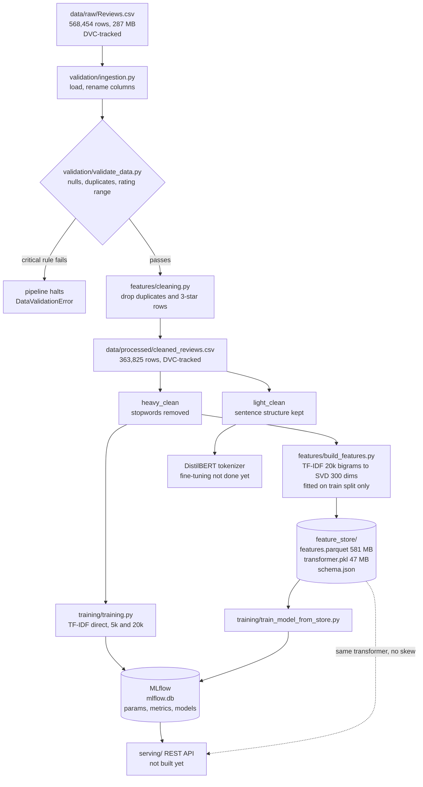

# Review Sentiment Classifier

Classifies customer product reviews as Positive or Negative. Built as an ML
engineering project, so the focus is the full pipeline, not just the model:
data validation, a feature store, experiment tracking, and dataset versioning.

Dataset is Amazon Fine Food Reviews, 568,454 rows. A review's star rating becomes
the label: 4 or 5 stars is Positive, 1 or 2 is Negative. 3-star reviews are dropped
as neutral.

| | |
|---|---|
| Best model | Logistic Regression on bigram TF-IDF |
| Macro F1 | 0.8729 |
| Accuracy | 0.9249 |
| Pipeline runtime | about 23 seconds on all 568k rows |

## Architecture



Two feature paths exist on purpose. `training/training.py` uses TF-IDF directly and
scores higher. The feature store trades some accuracy for guaranteed consistency
between training and serving. See [design decisions](#design-decisions).

## Repo layout

```
pipeline.py                          run Week 1 end to end, writes artifacts
harness_m2.py                        same stages, prints input/output, writes nothing
validation/ingestion.py              load raw CSV, rename columns
validation/validate_data.py          quality checks, halts on critical failure
features/cleaning.py                 heavy_clean and light_clean
features/feature_engineering.py      TF-IDF builder, DistilBERT tokenizer
features/build_features.py           builds the feature store
training/training.py                 baseline models from the cleaned CSV
training/train_model_from_store.py   model trained from the feature store
feature_store/                       features.parquet, transformer.pkl, schema.json
model_store/  serving/  ui/          placeholders, not yet written
reports/validation_report.md         data validation write-up
plan.md                              task tracking and open items
```

## Setup

Needs Python 3.13 and [uv](https://docs.astral.sh/uv/).

```bash
git clone <repo-url>
cd sentiment-classifier

uv venv venv
uv pip install --python venv -r requirements.txt
```

The datasets are versioned with DVC, not stored in git. Fetch them with:

```bash
uv run dvc pull
```

**No DVC remote is configured yet**, so `dvc pull` will not work from a fresh clone.
Until that is set up, put `Reviews.csv` into `data/raw/` by hand. The file is available
from [Kaggle](https://www.kaggle.com/datasets/snap/amazon-fine-food-reviews).

## How to run

**Step through each stage, writing nothing.** Best way to see what the pipeline does.
It prints the input and output of all five stages and pauses between them.

```bash
venv/bin/python harness_m2.py
```

**Run the real pipeline.** Writes `cleaned_reviews.csv`, `validation_report.json`,
and `tfidf_vectorizer.pkl` into `data/processed/`.

```bash
venv/bin/python pipeline.py --input data/raw/Reviews.csv --text-col Text --rating-col Score
```

**Build the feature store.** Reads the cleaned CSV, writes `feature_store/`.

```bash
venv/bin/python features/build_features.py
```

**Train the baseline models.** Two TF-IDF variants, logged to MLflow.

```bash
venv/bin/python training/training.py
```

**Train from the feature store.** Logs a combined transformer-plus-classifier model,
so anything served carries its own feature logic.

```bash
venv/bin/python training/train_model_from_store.py
```

**View the experiments.**

```bash
venv/bin/mlflow ui --backend-store-uri sqlite:///mlflow.db
```

## Results

### Data pipeline

| Stage | Result |
|---|---|
| Ingested | 568,454 rows |
| Validation | 0 nulls, 0 empty text, 0 invalid ratings, 174,875 duplicates found |
| After cleaning | 363,825 rows, 204,629 dropped |
| Labels | 306,758 positive, 57,067 negative |

Re-running the pipeline produces a byte-identical `cleaned_reviews.csv`
(md5 `7a6af401b4782822d0606ac2c96c3084`), so the data stages are reproducible.

### Models

All use `class_weight="balanced"`. Metrics are on a held-out 20% stratified test split.

| Run | Features | Accuracy | Macro F1 | ROC AUC |
|---|---|---|---|---|
| `logreg-tfidf-bigram` | TF-IDF 20k, unigram + bigram | 0.9249 | **0.8729** | 0.9750 |
| `logreg-tfidf-unigram` | TF-IDF 5k, unigram only | 0.8977 | 0.8347 | 0.9608 |
| `logreg-feature-store-svd300` | TF-IDF 20k, then SVD to 300 | 0.8615 | 0.7878 | 0.9387 |

The bigram run beats the unigram run by 0.038 Macro F1. Two things differ between them,
so the credit is shared: bigrams add word pairs, and the vocabulary grows from 5,000 to
20,000. Word pairs should matter here, because "not good" and "good" mean opposite things
while a unigram model sees the same `good` token in both. Separating the two effects would
need a run at 20,000 unigrams, which has not been done.

The last two rows are a fair comparison, since both start from the same 20,000 TF-IDF
features. The only difference is SVD compression to 300 dimensions, and it costs 0.085
Macro F1.

## Design decisions

**Macro F1, not accuracy.** The cleaned data is 84% positive, a 5.4-to-1 split. A model
that always answers Positive scores about 84% accuracy while being useless. Macro F1
averages the score of each class equally, so ignoring the minority class is penalised.
Every model also sets `class_weight="balanced"`.

**Two cleaning versions from one source.** `heavy_clean` strips stopwords and punctuation,
which suits TF-IDF, since it treats words as independent counts. `light_clean` keeps
sentence structure, which DistilBERT needs, because it reads word order. Running both
from the same cleaning step keeps the two models on identical rows.

**3-star reviews are dropped.** A 3-star review is genuinely ambiguous, so keeping it
would add noise to a two-class problem. This costs 42,640 rows.

**The feature store transformer is fitted on the train split only.** Fitting on all rows
would bake test-set word statistics into every feature value, which leaks. Transforming
all rows afterwards is safe, since it only applies rules already learned. The store keeps
every row with a `split` column, 291,060 train and 72,765 test.

**The feature store trades accuracy for consistency.** Compressing 20,000 TF-IDF features
into 300 SVD dimensions costs 0.085 Macro F1 against using TF-IDF directly. What it buys
is a fixed 300-column schema and one saved transformer shared by training and serving, so
the two cannot compute features differently. That failure, training-serving skew, is hard
to detect because both sides look correct in isolation. SVD is still the right way to
reach 300 columns: it compresses all 20,000 features into combinations rather than
discarding 19,700 of them, worth 0.063 Macro F1 over keeping only the top 300 terms.

**Validation can halt the pipeline.** Critical rule failures raise `DataValidationError`
and stop the run, rather than letting bad data reach a model quietly.

## Data versioning

DVC 3.67.1 tracks the four large files. Git stores only small `.dvc` pointers, each
holding an md5 and a byte size.

| File | Size |
|---|---|
| `data/raw/Reviews.csv` | 287 MB |
| `data/processed/cleaned_reviews.csv` | 416 MB |
| `feature_store/features.parquet` | 581 MB |
| `feature_store/transformer.pkl` | 47 MB |

`schema.json` stays in git instead, because it is small text and readable diffs are
useful there.

## Known gaps

- No DVC remote, so `dvc pull` fails from a fresh clone.
- DistilBERT is tokenized but not fine-tuned. Needs a GPU decision.
- `serving/`, `ui/`, and `model_store/` are still empty.
- `requirements.txt` uses open `>=` ranges and installed versions have drifted well
  past them, so pin exact versions before claiming reproducibility.
- Stage 4 of `pipeline.py` fits TF-IDF on all rows with no split, so
  `tfidf_vectorizer.pkl` has seen the test set. Nothing trains from it, but it overlaps
  the feature store and should probably be removed.

See `plan.md` for full task tracking.
